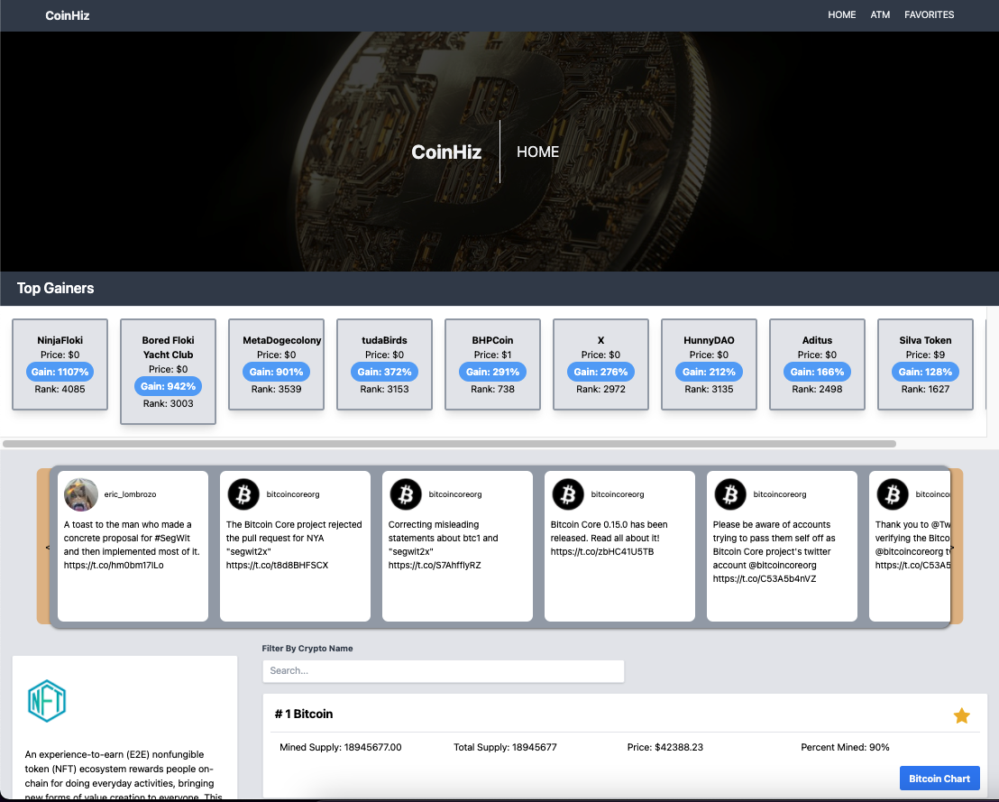
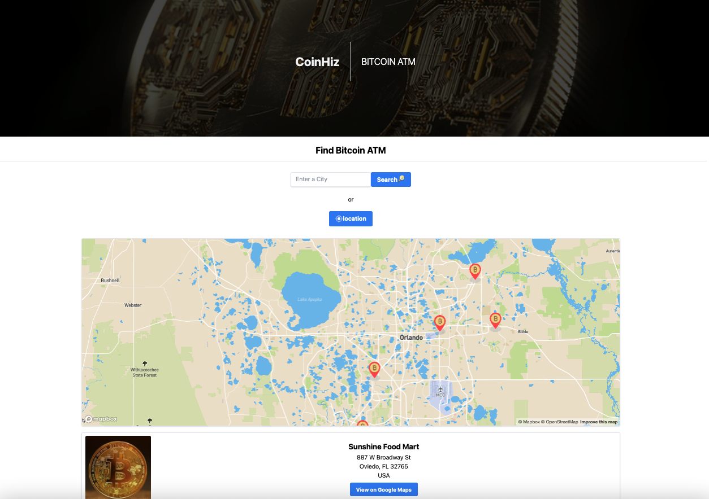
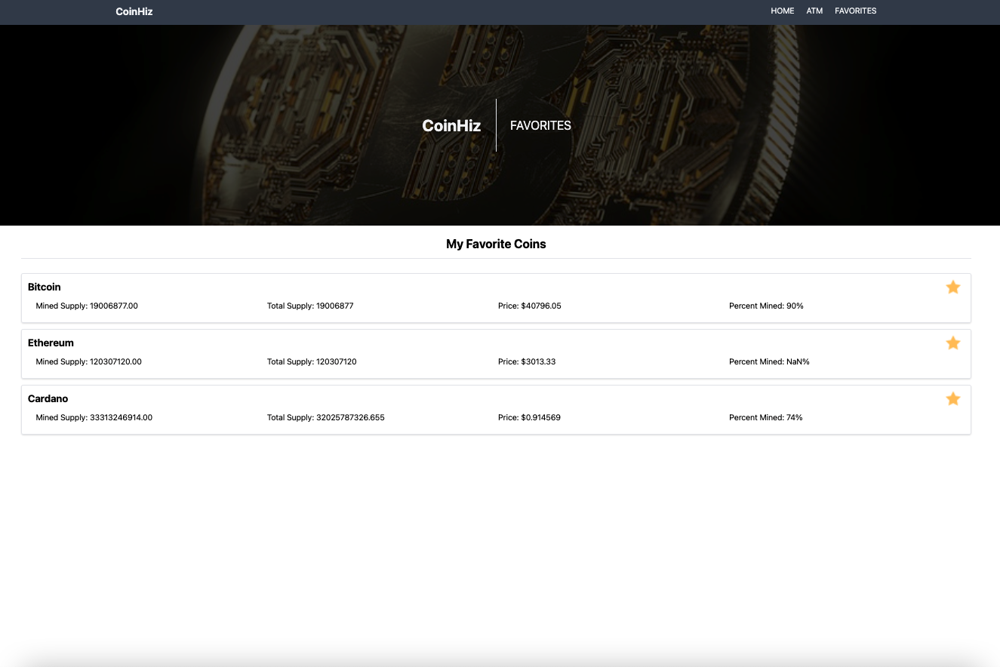

# Coinhiz

## Description

Coinhiz is a Crypto currency application the gives users information, current price, and a chart with historical price of the coin.
Give you the ability to save your favorite coins and also get the locations of any Bitcoin atm around you or in any city.

This application is built with HTML5, CSS3, JavaScript, jQuery, Tailwind CSS, and Mapbox API. Also, it uses the Coinlore API to get the current price of the coin. Add to favorites will save the coin to your local storage.

## Click [here](https://jimenezraul.github.io/coinhiz/) to view the live application.

## Table of Contents

- [Coinhiz](#coinhiz)
  - [Description](#description)
  - [Click here to view the live application.](#click-here-to-view-the-live-application)
  - [Table of Contents](#table-of-contents)
  - [Tools & Resources](#tools--resources)
  - [Screenshot](#screenshot)
  - [Installation](#installation)
  - [Start application](#start-application)
  - [Contributors](#contributors)
  - [Contact](#contact)

## Tools & Resources

- [HTML5](https://developer.mozilla.org/en-US/docs/Web/Guide/HTML/HTML5)
- [CSS3](https://developer.mozilla.org/en-US/docs/Web/CSS/CSS3)
- [Tailwind CSS](https://tailwindcss.com/)
- [WebAPI](https://developer.mozilla.org/en-US/docs/Web/API)
- [Javascript](https://developer.mozilla.org/en-US/docs/Web/JavaScript)
- [Server Side](https://developer.mozilla.org/en-US/docs/Learn/Server-side_web_APIs/First_steps)

## Screenshot

Main Page:

Bitcoin ATMs:

Favorites Coins:


## Installation

```
git clone git@github.com:jimenezraul/coinhiz.git
cd coinhiz
```

## Start application

Install VS code Live Server plugin and start the appication by right click on the index.html and selection open with Live Server.

## Contributors

- [Raul Jimenez](https://github.com/jimenezraul)
- [Chris Waters](https://github.com/Waters000)
- [Garrett Hilberling](https://github.com/garretthilberling)
- [Jonathan McDonnell](https://github.com/Johnnyboy7781)
- [Dknowles44](https://github.com/Dknowles44)
- [Brady Stafford](https://github.com/BradyStafford)

## Contact
- Raul [Email](mailto:jimenezraul1981@gmail.com)